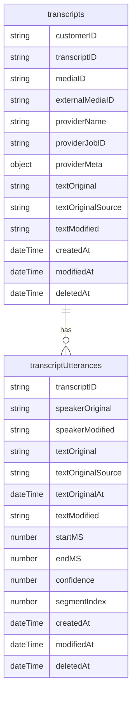

## Project Goal
Leverage AI to produce meeting minutes for public meetings based on:
- Agenda item titles and descriptions
- Text transcripts of media files
- Future: votes from the voting system (via API)
- Future: agenda item attachments (via API)

## Repository Structure
- `backend/`: queue worker runtime for transcript ingestion/finalization jobs + monitoring endpoints
- `frontend/`: future UI application
- `shared/`: shared contracts/types/utilities between frontend and backend

## Goals
- Create accurate, readable minutes aligned to agenda items
- Provide multiple display modes for clerk needs
- Improve accessibility with audio descriptions of silence
- Keep outputs consistent and easy to publish
- Provide an editor for transcripts such that diarized speakers can be individually edited (eg for mis-identified speaker in the diarization process) or group (eg change all "Speaker ABC" to "Timmy Smith")
- Provide captions in SRT / VTT based on the transcript.  This should be stored in the filesystem and re-generated based on the last-edit time of the transcript.

## Outputs
**Current**
- Meeting-wide summary (example: "Key themes, decisions, and next steps")
- Per-agenda-item summaries (example: "Item 3: budget amendment approved")
- Timestamped transcript segments linked to agenda items (example: "00:12:34–00:18:02 → Item 2")
- Closed Captions
- Minutes variants for each display mode (example: "Action Minutes" and "Hybrid")
- Silence-description audio track (mp4/aac) (example: "There is silence now for the next 2 minutes and 25 seconds.")

**Future**
- Votes pulled from the digital voting system (example: "Item 4: 5–2–0")
- Agenda item attachments (example: "Exhibit A: PDF packet")

## Raw Provider JSON
We store the full transcription provider response in block/object storage and keep a reference (URL plus checksum) in the database for audit and future reprocessing.

## Transcript Storage Structure
- `transcripts`: one document per transcription job/media; store `customerID`, `transcriptID`, `mediaID`, optional `externalMediaID`, and `textOriginal`.
- `transcriptUtterances`: one document per utterance with `transcriptID`, speaker/text fields, `startMS`, `endMS`, `confidence`, `segmentIndex`.


Note: `textOriginalSource` enum values: `AUTOGEN:REVAI`, `AUTOGEN:ASSEMBLY`, `AUTOGEN:DEEPGRAM`, `HUMAN:CAPTIONER_NAME_HERE`, `HUMAN:CUSTOMER_INSERTED`.

### Provider Metadata (`providerMeta`)

The `providerMeta` field stores provider-specific metadata for audit and debugging purposes. This includes all metadata from the provider response **except** the actual transcript content (text, words, utterances).

**AssemblyAI providerMeta example:**
```json
{
  "id": "a5b6ee69-1331-4293-9bfe-12bc6ad1b34d",
  "language_model": "assemblyai_default",
  "acoustic_model": "assemblyai_default",
  "language_code": "en_us",
  "status": "completed",
  "audio_url": "https://cdn.assemblyai.com/upload/...",
  "confidence": 0.9082543,
  "audio_duration": 9757,
  "speaker_labels": true,
  "speaker_options": { "min_speakers_expected": 1, "max_speakers_expected": 16 }
}
```

**DeepGram providerMeta example:**
```json
{
  "request_id": "2479c8c8-8185-40ac-9ac6-f0874419f793",
  "sha256": "154e291ecfa8be6ab8343560bcc109008fa7853eb5372533e8efdefc9b504c33",
  "created": "2024-02-06T19:56:16.180Z",
  "duration": 25.933313,
  "channels": 1,
  "models": ["30089e05-99d1-4376-b32e-c263170674af"],
  "model_info": { "30089e05-99d1-4376-b32e-c263170674af": { "name": "2-general-nova", "version": "2024-01-09.29447", "arch": "nova-3" } }
}
```

**What's NOT stored in providerMeta:**
- `text` / `fullText` / `transcript` (stored in `textOriginal` field)
- `words` array (too large, not needed for audit)
- `utterances` array (stored as TranscriptUtterances documents)

CoreAPI-Client documentation is in `/Users/dan/Projects/CDS/com-champds-coreapi-client/README.md`

## Transcript Ingestion Worker

This project runs as a `@champds/cds-job-queue` worker. It consumes transcript-related jobs and processes them asynchronously.

Supported worker scopes:
- `transcript:ingest:provider-json`
- `transcript:ingest:caption-file`
- `transcript:transcribe:media`
- `transcription-poll`
- `transcript:enhance:captions`

For `transcript:transcribe:media`, the worker now returns a `details.pollingJob` payload describing the follow-up `transcription-poll` job that the external producer should enqueue.

## KeyTerms

For `transcript:transcribe:media`, key-term hinting is passed via `payload.options.keyTerms`.

If you want event-driven AI key-term extraction, provide:
- `payload.cdsV1EventID`
- `payload.options.useAIKeyHintExtraction: true`

Caller-provided `options.keyTerms` are treated as additive and kept at the front of the merged list.
`cdsV1EventID` can still be used for media resolution even when `useAIKeyHintExtraction` is `false`.

### Provider Limits

- `ASSEMBLYAI`
  - Per-term max length: `100` chars (longer terms are filtered)
  - `slam-1` path uses `keyterms_prompt`, max `100` terms
  - Non-`slam-1` path uses `word_boost` fallback

- `DEEPGRAM`
  - Key terms are supported for `nova-3` / `flux` model families
  - Per-term max length: `100` chars (longer terms are filtered)
  - Max `100` terms

- `REVAI`
  - Uses `custom_vocabularies[].phrases`
  - Per-term max length: `255` chars (longer terms are filtered)
  - No explicit hard term-count cap in current code

### Model Selection

Provider model selection is passed through `payload.options.model`.

- `ASSEMBLYAI`
  - `options.model` maps to AssemblyAI `speech_model`
  - If omitted, current behavior defaults to `slam-1` keyterm path logic

- `DEEPGRAM`
  - `options.model` maps to Deepgram query param `model`
  - If omitted, defaults to `nova-3`

- `REVAI`
  - `options.model` is currently ignored
  - Warning emitted: `REVAI_IGNORED_MODEL`

### Monitoring Endpoints
- `GET /health`
- `GET /status`

### Running the Service
```bash
cd backend
source ~/.nvm/nvm.sh && npm install
source ~/.nvm/nvm.sh && npm run dev   # Development with hot reload
source ~/.nvm/nvm.sh && npm start     # Production
```

Service runs on port 7002 by default. See `docs/API-ENDPOINTS.md` for full documentation.

### Configuration
Configuration can be provided via:
1. JSON config file: `{project}.{mode}.appConfig.json`
2. Environment variables (for local development):
   - `CORE_API_BASE_URL` - CoreAPI base URL (default: http://localhost:7001/v1)
   - `CORE_API_KEY` - CoreAPI authentication key
   - `ASSEMBLYAI_API_KEY` - AssemblyAI API key
   - `DEEPGRAM_API_KEY` - DeepGram API key
   - `SILENCE_DETECT_NOISE_DB` - ffmpeg silencedetect noise threshold in dB (default: -35)
   - `SILENCE_DETECT_MIN_SECS` - minimum silence duration in seconds (default: 2)
   - `SILENCE_CHUNKING_ENABLED` - split non-silent segments before provider submission (default: true)
   - `SILENCE_MAX_SEGMENT_COUNT` - maximum allowed segment count before failing (default: 12)
   - `SERVER_PORT` - Server port (default: 7002)

Provider-level queue concurrency can be configured in the app config file:

```json
{
  "concurrency": {
    "PROVIDER_DEFAULT_MAX_CONCURRENCY": 2,
    "PROVIDER_MAX_CONCURRENCY": {
      "ASSEMBLYAI": 1,
      "DEEPGRAM": 3,
      "REVAI": 1
    }
  }
}
```

- Values must be positive integers.
- If no `concurrency` section is provided, provider concurrency is unbounded.
- Limits are enforced per provider for `transcript:transcribe:media` and `transcription-poll` jobs.

When a provider limit is hit:

1. The worker marks the job as running, then tries to acquire a slot for that job's provider.
2. If all slots are in use, the job waits in-process until another job for the same provider finishes.
3. While waiting, status updates are emitted (throttled) with:
   - `PROVIDER_NAME`
   - `PROVIDER_MAX_CONCURRENCY`
   - `PROVIDER_ACTIVE_CONCURRENCY`
   - `PROVIDER_WAIT_TIME_MS`
4. As soon as a slot is available, the job proceeds normally and reports `PROVIDER_QUEUE_WAIT_MS`.
5. If the job is cancelled while waiting, it is marked cancelled and never enters provider execution.
6. Slots are released in a `finally` path, so failed/completed jobs both free capacity for the next waiting job.

## Prerequisites
To generate minutes, we need:
- A transcript derived from media
- Automated (or human-generated) timestamps tied to agenda items
  - This is the difficult part: tying agenda items to utterances at the right moments.
  - This will involve submitting agenda items and utterances to an AI agent to synthesize suggested timestamps.
- Per-timestamp summaries (per agenda item)
- A meeting-wide summary

## Process Flow
1. The customer (or CHAMP on their behalf) creates an event and adds the agenda with any attachments.
2. The customer then attaches media to the event (live stream or VOD).
3. Once the media is VOD (on-demand), the customer chooses to generate automated minutes. This consists of:
   - Strip audio from video to create an audio-only rendition.
   - Detect silences greater than a threshold.
     - Optionally split the audio into sound-only sections for the next step.
   - Send the media to a third-party transcription provider or API.
   - Receive the transcript with timecodes.
     - If media was sent in sections, re-time the output to match the single file (with silences included).
4. Use agenda items + utterances to synthesize suggested agenda timestamps (AI-assisted).
   - Agendas may be out of order or revisited.
   - This produces a first-pass alignment.
5. Review and adjust the suggested alignment in a UI to fix jumps and edge cases.
6. Generate per-timestamp summaries (per agenda item) and a meeting-wide summary.
7. Generate the audio-description track once timestamps and silence data exist.
   - Include silence descriptions (detailed below).
   - If enabled, include agenda item titles at the relevant timestamps.
   - If enabled, include descriptions of the attachments (total count and optionally title of each).
   - The intro includes the event title and description via text-to-speech.

## Minutes Output Modes
For the clerk, we support multiple display formats and must provide all because the active format is dynamic:
- "Clerk Minutes" - Blank document (eg clerk types up from whole cloth)
- "Action Minutes" - Votes pulled from the digital voting system (via API)
- "Summary Minutes" - Mini-summaries from timestamp-based speech-to-text results (optionally include votes, if available)
- "Full Transcript" - speech-to-text by timestamp (tied back to agenda items)
- "Hybrid" - Pick from the above items to show
- The clerk will select which of these becomes the active minutes in PlayDot

## Accessibility Audio for Silence
- We plan to include descriptive audio for periods of silence to improve accessibility. The idea is to use AI text-to-speech to produce an audio
track (mp4/aac) with utterances like: "There is silence now for the next 2 minutes and 25 seconds."
- Viewers can use timestamps to skip ahead or remain in the silence.
